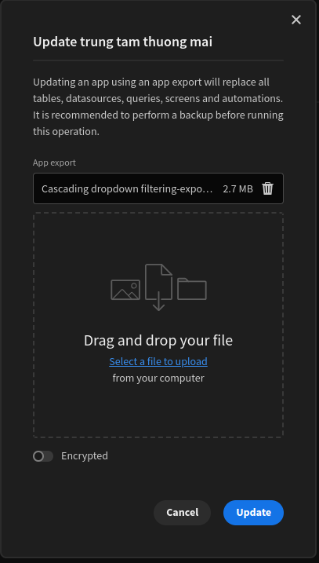

## Ứng dụng hỗ trợ khách hàng mua sắm tại trung tâm thương mại

Trong bối cảnh thị trường bán lẻ ngày càng cạnh tranh, việc cung cấp trải nghiệm mua sắm tiện lợi và hiệu quả cho khách hàng là vô cùng quan trọng. Bài toán này nhằm phát triển một ứng dụng hỗ trợ khách hàng mua sắm tại trung tâm thương mại, giúp họ tìm kiếm thông tin về sản phẩm, khuyến mãi, và địa điểm cửa hàng một cách nhanh chóng. Mục tiêu cuối cùng là nâng cao trải nghiệm khách hàng, tăng cường sự hài lòng và thúc đẩy doanh số bán hàng cho các cửa hàng trong trung tâm thương mại.


## Công nghệ sử dụng

- **Budibase**: Phần mềm tự do nguồn mở ít mã
- **BudibaseDB**: Hệ quản trị cơ sở dữ liệu được xây dựng bởi Budibase dựa trên couchDB


## Các chức năng chính

- Tìm kiếm cửa hàng, sản phẩm
- Đăng ký cửa hàng
- Gửi form thông báo mất đồ


## Cấu trúc thư mục
```text
trung-tam-thuong-mai/
    ├── asserts/
    │   ├── image.png
    │   └── ...
    ├── budibase/
    ├── src/
    │   ├── file.tar.gz
    │   └── ...
    ├── LICENSE
    ├── README.md
    └── setup.sh
```


## Cài đặt sử dụng

**Clone project về máy**
```bash
git clone https://github.com/CayDen-AI/trung-tam-thuong-mai.git
```

1. **Cài đặt và khởi chạy**
```bash
sh setup.sh
```

2. **Truy cập Budibase** <http://localhost:10000>

3. **Build ứng dụng**<br>


5. **Import ứng dụng**<br>

Để import ứng dụng, sau khi tạo ứng dụng vào `Settings > Export/Import > Import app` rồi kéo thả file tài nguyên vào, sau đó ấn `Update`<br>




## Liên hệ

Nguyễn Hải Đăng: 22a1001d0049@students.hou.edu.vn<br>
Lê Hoàng Phúc: 22a1001d0254@students.hou.edu.vn<br>
Nguyễn Trần Duy Anh: 


## Giấy phép

This project is licensed under the terms of the [Apache 2.0](./LICENSE) license.


## Contributors

<a href="https://github.com/CayDen-AI/trung-tam-thuong-mai/graphs/contributors">
  
</a>
